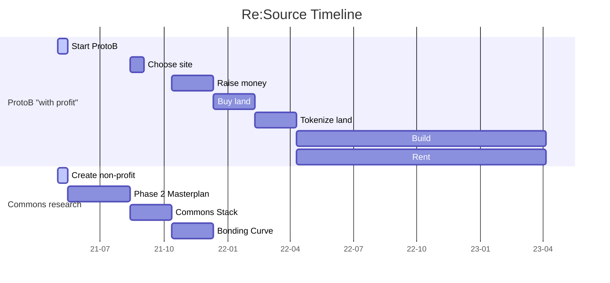

Re:Source Living Labs
===

## Table of Contents

[TOC]

## Vision

Re:Source provide living spaces to communities with the tools for thriving ecosystems.

Re:Source creates magical living spaces, and provides the tools for humans and nature to thrive.

Our vision is to research and apply what it means to live together as human beings in the 21st century.

For that we aim to create holistic Living Labs (re)connecting Technology and Nature towards a positive impact on humankind and the environment.

Re:Source will build and manage smart villages alongside applied research labs studying the different aspects of living together as human beings. The objective is to create a blueprint enabling communities around the world to organise themselves sustainably.

### Build
[Insert description of real estate business]

### Research

Our multidisciplinary team will focus on different key aspects of what would be needed for such spaces to exist and thrive:

* the application of emergent technologies to the realization of contemporary self-sufficient human habitats 
* innovation in collaborative business models and economic models
* innovation of future technologies
* innovation in renewable energy and communications systems 
* innovation in agriculture and food production
* innovation in bio-based materials 
* innovation in carbon sequestration, environmental remediation, and integrated nature-based solutions
* innovation in sustainable forest management
* innovation in self-determination via participatory and place-based governance and related policies 
* innovation in communal domestic and labor models
* innovation in urban-rural interactions and regional transition pathways for the circular bio-economy
* and beyond

As recognized by the UN Sustainable Development Goals, the EU’s Horizon Europe/Green Deal Missions, and the Paris Climate Accord, such topics reflect the highest priority mandates for assuring the continued and improved health and wellbeing of both humankind and the environment at large. 

Thus their advancement through this applied research project is directed at both the local/regional and international scope, with the intention of informing and validating techniques and strategies capable of adaptation and replication throughout the globe. 

In addition to direct communication of knowledge developed through various channels, such scalability will be enabled by the prospective living lab’s active engagement of researchers from all over the world, either through presential residencies or remote partnerships providing access to a wide range of experimental and empirical research opportunities and equipment regarding the aforementioned topics spanning the disciplines of ecology, forestry, agriculture, architecture, urbanism, design, technology, manufacturing, communications, governance, economics and more. 

The prospective living lab will also further education along these lines through programs for non-expert participation, with the potential to incorporate members of the general public as well as the 15-20 international students of IAAC’s Master in Advanced Ecological Buildings & Biocities (MAEBB) hosted annually at Valldaura Labs.

The research focus (modern, sustainable ways of living, working, cooperating, self-sufficient habitat etc.) is of high relevance to any society  in Europe and can contribute profoundly on our ways of sustainably, productively etc. living and working together in the 21st century.

The research is directed at an international scope, intending to develop and empirically validate an approach/blueprint for initiatives like these all around the globe.
     
The living lab is aiming to be open for and even endorsing international research/ers from all over the world, willing to share the relevant insights in an international/global community with a wide variety of experimental/empirical research opportunities ranging from social to ecological and economical matters.

## Timeline
---

---
    

## Smart Village

#### Multi-generational cohousing

~30 dwellings composed of:
* individual dwelling units of ~20 m2, comparable to the [Niu Haus](https://niu-haus.com/) prototype, either with autonomous infrastructures or infrastructures serving 'clusters' of individual units
* family-sized dwelling units, comparable to the [Fab Lab Solar House](https://iaac.net/project/fab-lab-solar-house/) prototype

#### Activity center

A mixed-use facility of ~1.000 - 2.000 m2 comprising co-working offices, workshop and lab facilities, multimedia studio space, lecture space, and communal facilities.

#### Food tech

Agricultural amenities to enable sustainable food systems using gardens, orchards, a botany lab, greenhouses, agroforestry, composting facilities, mushroom growrooms, and potentially some hydroponic systems.

#### Collaborative decision-making

#### Innovative crypto funding & Exit to community ownership model

#### Self sufficient & resilient
Every buildings are autonomous energetically.

#### Open source data

#### Business center

On a case by case basis we will provide amenities for businesses to foster a local economy in and around the village.

## Braindump
Startup that buy, builds on, and exploit Land.

Exit to community via a Token scheme.

Two main roles: Investor and Resident
People can have both.

Investors put some money in the project. Have decision making power proportional to their investment. Benefit is distributed to Investors directly or by raising the price of the token.

Residents pay rent, over time they get Investors shares (Exit to community https://e2c.how/). They have weighted decision making power as they are impacted.

ProtoB "with profit" business.

Commons research organisation for better living. (need a better name)

###### tags: `Smart Village`
